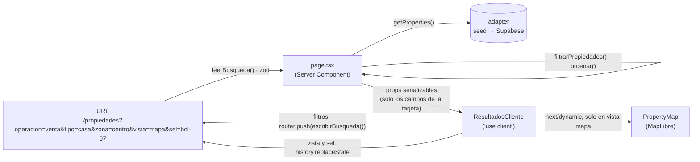

# Arquitectura — Bolívar Inmo

> El **objetivo** al cerrar el hito 1. Donde hoy el código es distinto, se marca *(hoy: …)*.
> Las decisiones de diseño visual están en la skill `identidad-visual` (nace en el hito 1).

## Stack

| Pieza | Qué | Notas |
|---|---|---|
| Framework | **Next.js 16.3** App Router + React 19.2 + TypeScript | `searchParams` y `params` son Promises; `src/proxy.ts` reemplaza a middleware |
| Estilos | **Tailwind CSS v4** | Tokens en `@theme` de `src/app/globals.css`, con contrastes medidos |
| Componentes | **shadcn/ui sobre Base UI** (`@base-ui/react`, estilo `base-nova`), `class-variance-authority`, `tw-animate-css` | Calcado de `~/dev/clubdelcoctel/components.json`. *(hoy: botón hecho a mano, sin librería)* |
| Íconos | **lucide-react** | *(hoy: Phosphor; se migra y se desinstala)* |
| Validación | **zod** | Para leer search params sin confiar en ellos |
| Mapa | **MapLibre GL 6** (BSD-3) | Isla cliente. Tiles: OpenFreeMap → PMTiles propio. *(hoy: Carto sin key)* |
| Auth | Supabase Auth con Google (`@supabase/ssr`) | Solo para inmobiliarias. Quien busca no tiene cuenta |
| Datos | Seed en `src/lib/properties/seed.ts` detrás de `adapter.ts` | Supabase con datos reales llega en el hito 2, **sin cambiar la firma del adapter** |
| Tests | **Vitest** (lógica pura) + **Playwright** (e2e mobile y escritorio) | *(hoy: sin Playwright)* |
| Diseño | Skill **Impeccable** (crítica y detector) + skill local `identidad-visual` | Calcadas de Club del Cóctel |

## Estructura

```
src/
├── app/
│   ├── page.tsx                      Inicio = paso 1 del buscador ("¿Qué estás buscando?")
│   ├── buscar/[paso]/page.tsx        Pasos 2-4: tipo · zona · detalles
│   ├── propiedades/page.tsx          Resultados: lista deslizable ⇄ mapa
│   ├── propiedades/[id]/page.tsx     Ficha de la propiedad
│   ├── inmobiliarias/ ingresar/ cuenta/ publicar/   (heredan el shell; se re-visten en el hito 2)
│   ├── api/streets/route.ts          (queda sin uso en el front del hito 1; ver hito 2)
│   └── auth/callback/route.ts
├── components/
│   ├── ui/          shadcn sobre Base UI: button, toggle, toggle-group, drawer, input, badge, dialog…
│   ├── marca/       logo (isotipo + nombre)
│   ├── shell/       header, menú, pie
│   ├── busqueda/    pasos del buscador + campos compartidos con la hoja de filtros
│   ├── resultados/  carrusel, tarjeta, selector de vista, hoja de filtros, resumen, vacío
│   ├── ficha/       galería, datos clave, características, ubicación, inmobiliaria, barra de contacto
│   └── map/         MapLibre (property-map, carga dinámica)
└── lib/                              TypeScript puro, sin Next ni React, con tests al lado
    ├── busqueda/    taxonomia · parametros · filtrar · contar · precios · resumen · pasos
    ├── properties/  types · seed · adapter
    ├── agencies/    types · seed
    ├── format.ts    precios, superficies, etiquetas
    ├── contact.ts   links de WhatsApp / teléfono / mail con mensaje armado
    ├── markers.ts   máquina de estados de los pines (select / expand / deselect)
    ├── geo.ts  brand.ts  site.ts  utils.ts  streets.ts
    └── supabase/
```

## Flujo de datos



- **Cambiar un filtro** es una navegación (`router.push`): el servidor vuelve a filtrar y
  renderizar. Con pocos cientos de avisos es instantáneo y mantiene una sola fuente de verdad.
- **Cambiar de vista o de propiedad seleccionada** no pide nada al servidor:
  `window.history.replaceState`, que Next 16 sincroniza con `useSearchParams`.
- **El buscador guiado** usa `next/form` con `method GET`: sin JS es un formulario común; con
  JS es navegación suave con prefetch.

## Invariantes

1. **La URL es la fuente de verdad de la búsqueda.** El contrato (nombres y valores de cada
   parámetro) está en `docs/hitos/hito-1/modelo-de-busqueda.md` § Contrato de URL y vive en
   código en `src/lib/busqueda/parametros.ts`. Un parámetro inválido **se ignora**, nunca
   rompe la página.
2. **`src/lib/` es puro y se escribe test-first.** Nada de `next/*`, `react` ni `window`.
   Componentes y páginas no filtran, no cuentan ni formatean: llaman a `src/lib`.
3. **Server Components por defecto.** `"use client"` solo donde hay interacción real:
   carrusel (slide activo), selector de vista, hoja de filtros, mapa, galería a pantalla completa.
4. **Lo que pueda no depender de JS, no depende.** Buscador guiado sin JS; tarjetas y "Ver
   detalles" son `<a>`; contactar es un `<a>` a `wa.me` / `tel:`.
5. **El mapa es una isla.** `next/dynamic` con `ssr:false`, se pide al abrir la vista mapa (y
   se precarga en segundo plano cuando la lista ya se ve). La atribución de OpenStreetMap
   queda **siempre visible** (la exigen los términos).
6. **Precios**: enteros en la moneda en que se publicó. **Nunca se convierte** entre pesos y
   dólares. `price: null` = "Consultar precio" (y queda afuera si hay filtro de precio).
7. **Nada de datos inventados en producción.** Los conteos ("12 casas") salen de los datos.
8. **Accesibilidad**: todo lo que se toca mide ≥ 44 px; contraste medido con script (texto
   ≥ 4,5, texto grande ≥ 3); foco visible; cada control con nombre accesible; el carrusel se
   puede recorrer con teclado y con botones, no solo deslizando.
9. **Presupuesto**: inicio y resultados en lista **no cargan MapLibre**. Lighthouse mobile
   Performance ≥ 90 en `/` y `/propiedades` (vista lista).

## Modelo de datos

El tipo `Property` y la taxonomía (operaciones, tipos, zonas, características) están
especificados en `docs/hitos/hito-1/modelo-de-busqueda.md`. Regla de nombres: **los
identificadores de código en inglés** (como el código existente: `Property`, `operation`,
`beds`) y **los valores de dominio en español**, porque son los mismos que van en la URL y se
ven en pantalla (`operation: "venta"`, `type: "quinta"`).
