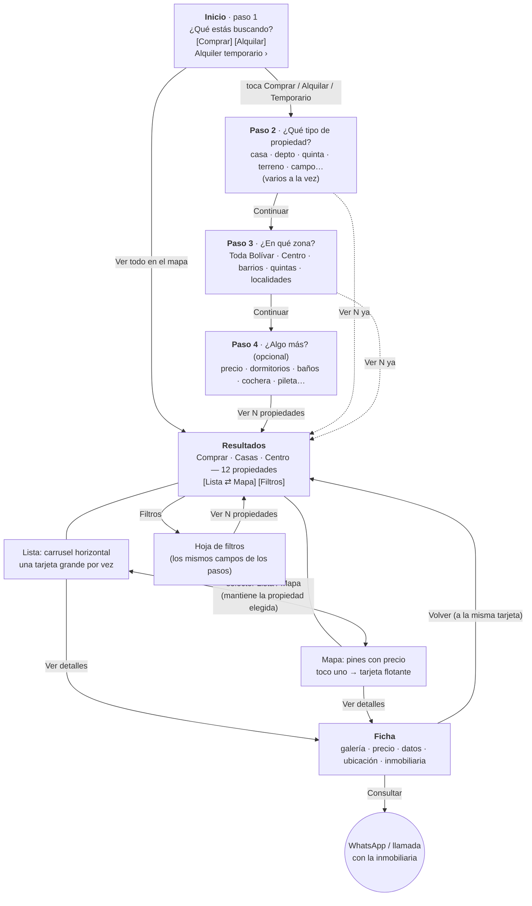
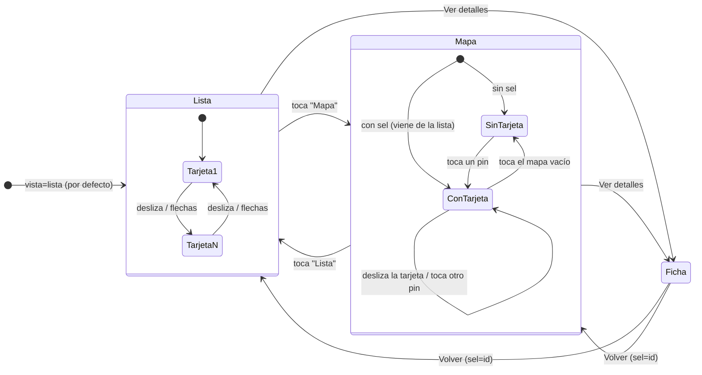
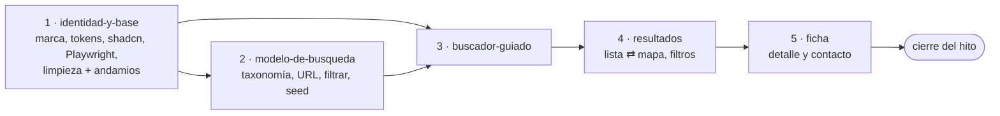

# Hito 1 — Rediseño mobile: buscar, ver, contactar

> **La spec madre del rediseño.** Acá está el recorrido entero, las pantallas, los diagramas y
> las decisiones que valen para todo el hito. Cada pantalla tiene su spec (con plan técnico y
> tareas) en esta carpeta; ver § 10. **Se implementa con `/siguiente`, en Plan Mode, una spec
> por vez.**

## 1. Lo que pidió Manuel (2026-10-08)

- **Cambio radical del front**, diseñado **primero para el celular**.
- **Simple pero elegante**, específico para buscar una propiedad: **sin fondos recargados ni
  animaciones llamativas**, claro y directo. **Más profesional que tandilprop**.
- Al entrar, **una pantalla para filtrar**. Lo primero, **grande y clarísimo: ¿comprar o
  alquilar?** Después el **tipo** (casa, departamento, casa quinta, terreno… los que se usan en
  Argentina), después **el barrio** si quiere uno, después otros filtros, y **buscar**.
- Los resultados tienen **una parte lista**, donde las propiedades **se recorren deslizando**
  (tipo carrusel, "para no bajar hasta abajo del todo"), y **una parte mapa** con esas mismas
  propiedades. **Si tocás una, aparece una tarjeta con "Ver más detalles"**.
- El proyecto se llama **bolivarinmo.com.ar**; el nombre ya puede ir en el header.
- Usar las librerías de los otros proyectos (Club del Cóctel) para el diseño, no las de
  animación.
- Dejar todo anotado (spec, plan, tareas) para hacerlo después con Plan Mode.

## 2. La idea

**Una herramienta, no una vidriera.** Quien entra a Bolívar Inmo viene a encontrar algo
concreto. El sitio le hace **una pregunta por pantalla**, con opciones grandes que se tocan con
el pulgar, le muestra **cuántas propiedades hay** antes de que se comprometa, y lo deja en los
resultados con dos formas de verlos: **deslizando** o **en el mapa**. De ahí, un toque a la
ficha y otro a WhatsApp con la inmobiliaria.

Principios (en orden; si dos chocan, gana el de arriba):

1. **Claridad antes que estilo.** Cada pantalla tiene una sola pregunta o una sola tarea, y
   un solo botón principal.
2. **El pulgar manda.** Lo importante está en la mitad de abajo de la pantalla; nada que se
   toque mide menos de 44 px; los botones principales van fijos abajo.
3. **Nunca un callejón sin salida.** Siempre se ve cuántas propiedades da la búsqueda; si da
   cero, se ofrece qué filtro sacar y cuántas aparecen al sacarlo.
4. **Lo elegante sale de la tipografía, el espacio y un solo color**, no de efectos. El
   movimiento es solo de transición (≤ 200 ms) y se apaga con `prefers-reduced-motion`.
5. **Rápido en un Android barato y dentro de Instagram.** Inicio y lista no cargan el mapa; lo
   que puede andar sin JS, anda sin JS.

La dirección visual (marca, paleta, tipografía) está en
[`identidad-y-base.md`](identidad-y-base.md) § Dirección visual: **"el cartel y el plano"**.

## 3. La referencia: tandilprop.com.ar

Relevada el 2026-10-08 a 390 px. Capturas en `docs/references/tandilprop/` (carpeta local,
ignorada por git).

| Qué hace bien (lo tomamos) | Qué hace mal (lo mejoramos) |
|---|---|
| El inicio arranca con "Quiero comprar / Quiero alquilar" | Las dos opciones son botones chicos sobre una foto aérea; el tipo es un `<select>` nativo y el barrio no existe. **Nosotros: una pregunta por pantalla, opciones grandes con ícono y conteo** |
| Tarjeta con foto, precio, operación, datos clave e inmobiliaria con logo | Una tarjeta debajo de la otra: para ver 20 hay que bajar 20 pantallas. **Nosotros: carrusel horizontal que entra en una pantalla** |
| Ficha con galería, precio, WhatsApp, compartir, inmobiliaria con matrícula | Datos rotos a la vista ("1 m²"), descripción en un bloque sin formato, el WhatsApp no queda fijo. **Nosotros: barra de contacto fija, datos que faltan no se muestran, descripción con "Leer más"** |
| Páginas por categoría con resumen ("171 casas, mediana USD 140.000"), buenas para Google | — **Lo anotamos para el hito 3 (SEO)** |
| Tiene búsqueda por mapa | El mapa es **otra página** y los filtros ocupan **toda la primera pantalla**; el mapa aparece recién abajo. **Nosotros: el mapa es la otra vista de los mismos resultados, a pantalla completa, con un toque** |
| Filtros: operación, moneda, precio, "apta crédito", más filtros | Checkboxes chicos para la operación (se pueden marcar comprar y alquilar a la vez: no tiene sentido). **Nosotros: la operación es una sola, elegida al principio** |

🙋 **Manuel dijo que iba a pasar otra referencia de cómo tendría que verse.** Cuando llegue,
va a `docs/references/` y se mira en `identidad-y-base` antes de cerrar la dirección visual.

## 4. El recorrido



Reglas del recorrido:

- **Desde el paso 2, siempre se ve el conteo** ("Ver 12 propiedades") y se puede saltar
  directo a los resultados. Nadie está obligado a contestar todo.
- **Atrás del navegador funciona en cada paso** (cada paso es una URL).
- **La búsqueda se comparte**: la URL de resultados o de la ficha, pegada en WhatsApp, abre lo
  mismo en otro celular.
- **Volver desde la ficha** deja al usuario en la misma tarjeta (o el mismo pin) que tocó.

## 5. Mapa de pantallas

| Ruta | Pantalla | Spec | Hoy |
|---|---|---|---|
| `/` | Inicio = paso 1: ¿Qué estás buscando? | [`buscador-guiado.md`](buscador-guiado.md) | Landing con hero animado |
| `/buscar/tipo` | Paso 2: tipo de propiedad | [`buscador-guiado.md`](buscador-guiado.md) | — |
| `/buscar/zona` | Paso 3: zona | [`buscador-guiado.md`](buscador-guiado.md) | — |
| `/buscar/detalles` | Paso 4: algo más | [`buscador-guiado.md`](buscador-guiado.md) | — |
| `/propiedades` | Resultados: lista ⇄ mapa + hoja de filtros | [`resultados.md`](resultados.md) | Mapa a pantalla completa con popovers |
| `/propiedades/[id]` | Ficha | [`ficha.md`](ficha.md) | Ficha simple |
| todas | Header, menú, pie, marca | [`identidad-y-base.md`](identidad-y-base.md) | "Inmu" |
| `/inmobiliarias`, `/ingresar`, `/cuenta`, `/publicar` | Heredan el shell nuevo; se re-visten en el hito 2 | — | — |

## 6. Las pantallas de un vistazo (360 px)

Detalle y comportamiento de cada control en su spec. Esto es el storyboard.

```
 INICIO                 PASO 2 · TIPO          RESULTADOS · LISTA     RESULTADOS · MAPA      FICHA
┌────────────────┐     ┌────────────────┐     ┌────────────────┐     ┌────────────────┐     ┌────────────────┐
│▣ bolívar inmo ☰│     │‹ Comprar   2/4 │     │▣ bolívar inmo ☰│     │▣ bolívar inmo ☰│     │‹        ⇪      │
│                │     │▬▬▬▬▬▬▬▬░░░░░░░░│     │Comprar·Casa ✎  │     │Comprar·Casa ✎  │     │┌──────────────┐│
│¿Qué estás      │     │¿Qué tipo de    │     │12 prop. [Filtr]│     │12 prop. [Filtr]│     ││   galería    ││
│ buscando?      │     │ propiedad?     │     │[▤ Lista][◎Mapa]│     │[▤ Lista][◎Mapa]│     ││          1/9 ││
│                │     │┌─────┐┌─────┐  │     │┌────────────┐┌ │     │ (US$95k)       │     │└──────────────┘│
│┌──────────────┐│     ││⌂Casa││▦Dpto│  │     ││   foto 4:3 ││ │     │    (US$120k)●  │     │VENTA · CASA    │
││ Comprar   48 ││     │└─────┘└─────┘  │     ││         1/8││ │     │  (US$80k)      │     │US$ 120.000     │
│└──────────────┘│     │┌─────┐┌─────┐  │     ││VENTA       ││ │     │                │     │Casa en Centro  │
│┌──────────────┐│     ││♣Qta ││▭Terr│  │     ││US$ 120.000 ││ │     │┌──────────────┐│     │180m² 3dorm 2bñ │
││ Alquilar  21 ││     │└─────┘└─────┘  │     ││Casa·Centro ││ │     ││▣ US$ 120.000 ││     │Descripción…    │
│└──────────────┘│     │  …             │     ││3d·2b·180m² ││ │     ││  Casa·Centro ││     │                │
│Temporario ›    │     │────────────────│     │└────────────┘└ │     ││  [Ver detalles]│     │────────────────│
│Ver todo en mapa│     │[Continuar     ]│     │   ‹ 3 de 12 ›  │     │└──────────────┘│     │[💬 Consultar]📞│
└────────────────┘     └────────────────┘     └────────────────┘     └────────────────┘     └────────────────┘
```

## 7. Resultados: estados



**La propiedad elegida (`sel`) es una sola para las dos vistas**: si en la lista estoy en la
tarjeta 3 y paso al mapa, el mapa se centra en esa propiedad con su tarjeta abierta, y al
revés.

## 8. Decisiones del hito

| # | Decisión | Por qué | Lo que se descartó |
|---|---|---|---|
| D1 | **Buscador guiado: una pregunta por pantalla**, cada paso es una URL | Es lo que pidió Manuel ("lo primero, grande y claro"); en el celu una sola pregunta se lee de un vistazo; atrás funciona solo | Navbar + popovers (spec archivada); formulario largo en una pantalla (tandilprop) |
| D2 | **La URL es la fuente de verdad** (contrato en [`modelo-de-busqueda.md`](modelo-de-busqueda.md)) | Se comparte por WhatsApp, renderiza en el servidor, atrás funciona | Estado en contexto o `localStorage` |
| D3 | **Lista = carrusel horizontal con `scroll-snap` nativo** | El gesto del sistema, sin librería, sin JS para deslizar | Embla/Swiper; lista vertical infinita |
| D4 | **Las fotos de una tarjeta se pasan con flechas visibles**, no deslizando | Deslizar ya significa "otra propiedad"; dos gestos iguales en el mismo lugar confunden | Fotos deslizables dentro de un carrusel deslizable; tocar mitades de la foto (estilo historias) |
| D5 | **Mapa en la misma página**, selector Lista / Mapa, misma selección | Es otra forma de ver los mismos resultados | Página de mapa aparte (tandilprop) |
| D6 | **La hoja de filtros reusa los campos de los pasos** | Un solo lugar donde se define cada control; se aprende una vez | Filtros distintos en el buscador y en resultados |
| D7 | **shadcn sobre Base UI, lucide, zod, tw-animate-css** (como Club del Cóctel). **Sin GSAP** | Lo funcional sin reinventar; Base UI trae Drawer, ToggleGroup, Dialog accesibles | GSAP, `vaul`, Magic UI |
| D8 | **MapLibre se queda; los tiles pasan a OpenFreeMap** (y a PMTiles propio antes de lanzar) | MapLibre es libre y sin límites; Carto exige key desde el 29/09/2026 | Carto, Mapbox, Google Maps (pagos o con tope) |
| D9 | **Solo modo claro** en el hito 1 | Mitad de verificación; tokens listos para sumar oscuro | Mantener el modo oscuro actual |
| D10 | **Contacto por WhatsApp con mensaje armado** + llamar, fijos abajo en la ficha | Es como se consulta en Bolívar; el mensaje dice qué propiedad es | Formulario de contacto (nadie lo contesta rápido) |
| D11 | **Precio en la moneda publicada**, sin convertir; "Consultar precio" cuando no hay | Honesto; el tipo de cambio es opinión | Conversión ARS ⇄ USD |
| D13 | **Foto real de Bolívar de fondo en el inicio**, buscador en tarjeta blanca encima (Manuel, 2026-10-08) | Sin foto "se ve mucho más vacío" | Inicio sin foto; franja de foto arriba |
| D14 | **Fotos de prueba libres** (Wikimedia Commons, Unsplash) con créditos en `public/images/CREDITOS.md` (Manuel, 2026-10-08) | Faltan fotos de seis tipos; se ven reales | Generarlas; repetir las 10 que hay |
| D12 | **Rangos de precio sugeridos calculados de los datos** + mínimo/máximo | En pesos, rangos fijos envejecen en meses por la inflación | Slider de dos manijas; rangos fijos en el código |

## 9. Preguntas abiertas para Manuel

> **Aprobadas el 2026-10-08** (Manuel: "arranca" + confirmación explícita). Contestadas: 1 →
> **Bolívar Inmo** (logotipo "bolívar inmo"); 3 → **sí, temporario chico en el inicio**.
> El resto corre con su default hasta que Manuel conteste. Commits en la rama
> `rediseno-mobile`, un commit por bloque; el merge a `main` cuando Manuel apruebe el resultado.

Entre paréntesis, lo que se hace si no hay respuesta.

1. **La marca**: ¿cómo se escribe? "Bolívar Inmo" (dos palabras, con tilde) / "BolívarInmo" /
   "bolivarinmo" en minúscula como el dominio. *(Default: el logotipo dice **bolívar inmo** en
   minúscula y el nombre en textos es **Bolívar Inmo**.)*
2. **La otra referencia** que ibas a pasar: ¿la mandás antes de cerrar la identidad?
   *(Default: se sigue con la dirección "el cartel y el plano" y se te muestra una muestra en el
   celu antes de seguir.)*
3. **Alquiler temporario**: ¿va como tercera opción chica en el inicio, o lo sacamos? En
   Bolívar se alquilan quintas por fin de semana; departamentos por día, poco. *(Default:
   tercera opción, chica, debajo de las dos grandes.)*
4. **Zonas**: la lista de barrios es provisional (§ Zonas de `modelo-de-busqueda.md`).
   ¿Conocés a una inmobiliaria que la revise? ¿Entran las localidades del partido
   (Urdampilleta, Pirovano…)? *(Default: se publica la lista provisional con las localidades.)*
5. **Modo oscuro**: hoy existe y el rediseño lo saca en el hito 1. ¿Ok? *(Default: sí, se saca.)*
6. **"Sumá tu inmobiliaria"**: ¿va un acceso en el menú y en el pie para inmobiliarias que
   quieran publicar, con WhatsApp del portal? Falta ese número en la FICHA. *(Default: va
   "Ingresar (inmobiliarias)" en el menú, sin número hasta tenerlo.)*

## 10. Las specs del hito



| # | Spec | Estado | Qué cubre |
|---|---|---|---|
| 1 | [`identidad-y-base.md`](identidad-y-base.md) | `done` (2026-10-08) | Marca Bolívar Inmo, dirección visual, tokens, tipografía, íconos, componentes base (shadcn + Base UI), shell (header, menú, pie), Playwright, limpieza del front viejo |
| 2 | [`modelo-de-busqueda.md`](modelo-de-busqueda.md) | `done` (2026-10-08) | Operaciones, tipos, zonas y características; contrato de URL; filtrar, contar, ordenar, rangos de precio, resumen; tipo `Property` nuevo y datos de prueba ampliados |
| 3 | [`buscador-guiado.md`](buscador-guiado.md) | `in-progress` (falta 👀 Manuel) | El inicio y los pasos 2 a 4 |
| 4 | [`resultados.md`](resultados.md) | `approved` | `/propiedades`: resumen, selector de vista, carrusel, mapa con tarjeta flotante, hoja de filtros, vacío; escritorio en dos columnas; tiles de OpenFreeMap |
| 6 | [`inicio-y-pie.md`](inicio-y-pie.md) | `draft` | Debajo de la foto del inicio: recién publicadas, por tipo, destacadas, por zona e inmobiliarias deslizando; pie completo (pedido de Manuel, 2026-10-08) |
| 6b | [`inicio-v2.md`](inicio-v2.md) | `approved` (2026-10-09) | El hero con el buscador en el primer pliegue, scroll normal, fondo casi blanco, bento de tipos y secciones compactas. Reemplaza el hero de `vivi-bolivar` y las secciones de `inicio-y-pie` |
| 5 | [`ficha.md`](ficha.md) | `approved` | `/propiedades/[id]`: galería, precio, datos, descripción, ubicación, inmobiliaria, similares, contacto fijo, vista previa al compartir |

Referencia relevada: [`referencia-tandilprop.md`](referencia-tandilprop.md).

## 11. Definición de terminado del hito

- [ ] Las cinco specs en `done`, cada una con su cierre.
- [ ] **E2E del recorrido entero** en Playwright, en tres tamaños (360 × 640 Android chico,
      390 × 844 iPhone, 1280 × 800 escritorio): inicio → Comprar → Casa → Centro → Ver N →
      deslizar → Mapa → tocar un pin → Ver detalles → el link de WhatsApp tiene el mensaje
      con la propiedad → Volver deja la misma tarjeta.
- [ ] **El buscador anda con JavaScript apagado** (proyecto de Playwright con JS desactivado):
      del inicio a los resultados.
- [ ] Ninguna página tiene scroll horizontal a 360 px; ningún error en consola.
- [ ] Lighthouse mobile Performance ≥ 90 en `/` y `/propiedades` (lista); el JS de MapLibre no
      está en la carga inicial de esas dos.
- [ ] Detector de Impeccable sin hallazgos en las cuatro pantallas principales.
- [ ] No queda nada del front viejo: ni "Inmu", ni `HeroInteractive`, `CountUp`, `Reveal`,
      `ExploreClient`, Phosphor, ni Archivo Black / Instrument Serif.
- [ ] 👀 **Manuel recorrió todo en su celular** por la IP de la LAN y lo aprobó.
